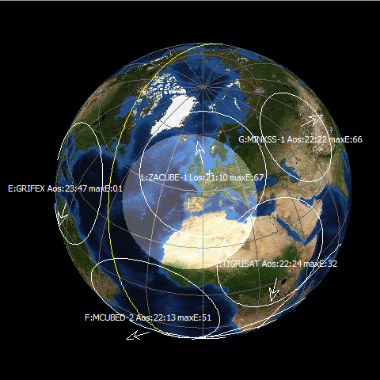

# satpc32-config
Satellite tracking with <a href="http://www.dk1tb.de/indexeng.htm" target="_blank">SatPC32</a>.

SatPC32 Configuration files:

<blockquote>
 The Primairy SatPC32 config files can be found in: %APPDATA%\Roaming\SatPC32 
</blockquote>

AmsatNames.txt 
<blockquote><pre>
 This file contains the AMSAT names of actual amateur radio satellites.
 The auxiliary file SatRename evaluates this file to replace the satellite
 names used in Space-Track TLE data files with their AMSAT names.

 Column #1 contains the 5-digit "Identification Number" used in TLE files 
           (data line #1, columns 3 - 7).
 Column #2 contains the satellite's 8-digit "International Designator" 
           (data line #1, columns 10 - 17),
 Column #3 contains the satellite's AMSAT name.

 When a new satellie is available, it can be added to this list.
 Note, that the "Identification Number" and the "International Designator" 
 must contain a fix number of digits.
 </pre></blockquote>

Doppler.sqf 
<blockquote><pre>
 This file contains all data required for the CAT tuning to operate. CAT 
 tuning only works for satellites whose frequencies are contained in the file. 
 To use the program's tuning functions during Vfo operation, these data are
 also needed.
 </pre></blockquote>

Prior.SQF 
<blockquote><pre>
 The program performs automatic satellite switching for satellites with a
 priority setting. This works as follows: If no priority satellite is in
 hearing range, the program switches to a priority satellite as soon as
 that satellite's elevation reaches the minimum elevation angle, provided
 the satellite effectively comes into hearing range.
 </pre></blockquote>

AosFiles.SQF 
<blockquote><pre> 
 Group files that are use by the SatPC32 WinAos program:
  Standard.aos
  Calpoly.aos
  Camsat.aos
  MyKepler.aos
  NewLaunch.aos
  Research.aos
  Russian.aos
  Weather.aos
  </pre></blockquote>

SatFiles.SQF 
<blockquote><pre>
 Group files that are used by the main SatPC32 program:
  Automatic.sat
  Standard.sat
  1MyKepler.sat
  1MyKepler.sat
  2MyKepler.sat
  3MyKepler.sat
  4MyKepler.sat
  5MyKepler.sat
  Camsat.sat
  Research.sat
  Russian.sat
  Temporary.sat
  Weather.sat
</pre></blockquote>

WisFiles.SQF 
<blockquote><pre>
 Group files that are used by the SatPC32 WinListen program:
  Standard.wis
  PacSat.wis
  SSBTransp.wis
  Micro.wis
  Weather1.wis
  Weather2.wis
  Diverse.wis
  Cubesat.wis
  </pre></blockquote>
